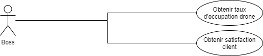

## Drone Delivery Command-Line Interface (CLI)

### Technology
[Java 8](https://www.java.com/fr/download/)

## Use Case

According to our use case the "Boss" can do the following things :



## Available Commands
```
DD > ?
  - bye: Exit Cookie on Demand
  - get-stats-users : Returns the average customer satisfaction
  - get-stats-users-from : Returns the average customer satisfaction from a date
  - get-stats-drones : Returns the average drone use per hour
  - get-stats-drones-from : Returns the average drone use per hour from a date
  - generate-stats-drones : Generates the drone stats entries per hour
  - generate-stats-users : Generates the customer satisfaction entries
  
```

### How to use
To launch the project get to the root project then use this command line `mvn clean package` then `mvn exec:java`
