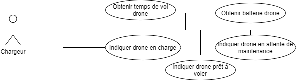

## Drone Delivery Command-Line Interface (CLI)

### Technology
[Java 8](https://www.java.com/fr/download/)

## Scenario
Le chargeur devra récupérer les drones ayant livré le colis. 
En fonction de son niveau de batterie deux cas s’offre à elle. 
Si la batterie n’est pas suffisante pour une nouvelle livraison elle devra le mettre en charge et grâce au système passer son statut à “En charge”. 
Si le drone peut effectuer une autre livraison ou qu’il a fini de charger, elle devra vérifier la durée de vol du drone. 
Si la durée est inférieure à 20 heures, elle passera son statut à “Prêt à livrer” et ira le poser sur l’étagère dédiée aux drones. 
Sinon, elle déposera le drone au garagiste et passera son statut à “En maintenance”.

## Use Case
According to our use case the "Chargeur" can do the following things :


## Available Commands
```
DD > ?
  - bye: Exit Cookie on Demand
  - edit-drone-status (id status[charge|maintenance|ready])
  - get-drone (id)
```

### How to use
To launch the project get to the root project then use this command line `mvn clean package` then `mvn exec:java`
