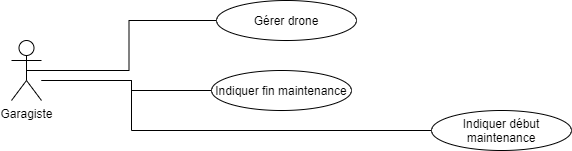

## Drone Delivery Command-Line Interface (CLI)

### Technology
[Java 8](https://www.java.com/fr/download/)

## Scenario
Le garagiste sera en mesure d’inspecter et de réparer les drones positionnés dans le garage et donc en attente de maintenance. 
Il pourra ensuite passer l’état du drone grâce au système à “Prêt à livrer”. 

## Use Case
According to our use case the "Garagiste" can do the following things :


## Available Commands
```
DD > ?
  - bye: Exit Cookie on Demand
  - add-drone (id weightCapacity speed)
  - edit-drone-status (id status[charge|maintenance|ready])
  - remove-drone (id)
  - get-drone (id)
```

### How to use
To launch the project get to the root project then use this command line `mvn clean package` then `mvn exec:java`
