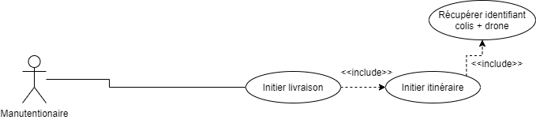

## Drone Delivery Command-Line Interface (CLI)

### Technology
[Java 8](https://www.java.com/fr/download/)

## Scenario
Le manutentionnaire devra décharger les camions des fournisseurs et ajouter au système les colis reçuents.
Pour effectuer une livraison il devra dans un premier temps récupérer grâce au système les informations de la prochaine livraison. 
Il pourra ainsi voir le numéro de colis ainsi que le numéro de drone à charger. 
Il devra ensuite attacher le colis au drone. 
Il pourra alors initier la livraison grâce à notre système qui chargera l’itinéraire via un système de cartographie. 
A son retour il devra indiquer le statut de la livraison (completée ou annulée)

## Use Case
According to our use case the "Manutentionnaire" can do the following things :



## Available Commands
```
DD > ?
  - bye: Exit Cookie on Demand
  - get-deliveries ()
  - get-delivery (trackingId)
  - edit-drone-status (id status[charge|maintenance|ready])
  - edit-delivery-status (trackingId status[completed|failed|inflight])
  - add-package (trackingId supplierName packageWeight destinationAddress)
  - edit-package (trackingId supplierName packageWeight destinationAddress)
  - remove-package (trackingId)
  - start-delivery (trackingId)
```

### How to use
To launch the project get to the root project then use this command line `mvn clean package` then `mvn exec:java`
