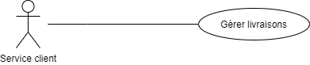

## Drone Delivery Command-Line Interface (CLI)

### Technology
[Java 8](https://www.java.com/fr/download/)

## Scenario
Le service client doit prendre en compte les demandes de livraison des clients par mail ou téléphone ainsi que consulter les disponibilités des drones pour la livraison souhaitée. 
Si le système indique qu’un drone est disponible au bon moment et suffisamment longtemps pour effectuer la livraison, alors on peut accepter cette livraison et l’ajouter au système en réservant l’horaire pour la durée de la livraison (celle-ci étant calculée en prenant en compte la durée du trajet estimée par l’API du Drone ainsi que les différentes possibles opérations à effectuer sur le Drone : charge, maintenance), l’adresse et le colis concerné.


## Use Case
According to our use case the "Service client" can do the following things :



## Available Commands
```
DD > ?
  - bye: Exit Cookie on Demand
  - add-delivery (trackingId shippingDateTime(yyyy-mm-dd) shippingTime(hh:mm))
  - edit-delivery-status (trackingId status[completed|failed|inflight])
  - get-deliveries ()
  - get-delivery (trackingId)
```

### How to use
To launch the project get to the root project then use this command line `mvn clean package` then `mvn exec:java`
