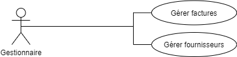

## Drone Delivery Command-Line Interface (CLI)

### Technology
[Java 8](https://www.java.com/fr/download/)

## Use Case

According to our use case the "Comptabilité / gestionnaire" can do the following things :



## Available Commands
```
DD > ?
  - bye: Exit Cookie on Demand
  - add-supplier (name contact(mail or phone))
  - add-supplier-contact (name contact(mail or phone))
  - get-supplier (name)
  - remove-supplier (name)
  - get-suppliers ()
  - get-paid-invoices
  - get-notpaid-invoices
```

### How to use
To launch the project get to the root project then use this command line `mvn clean package` then `mvn exec:java`
